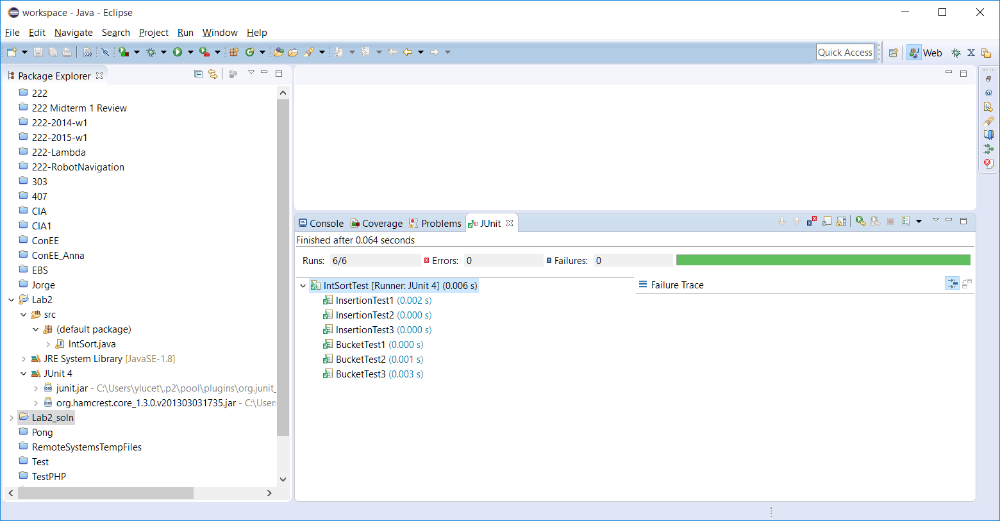
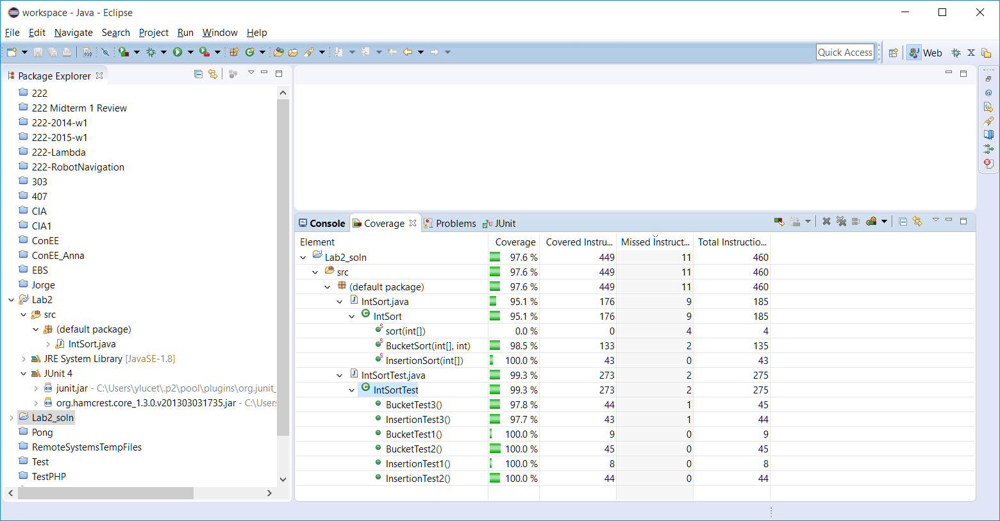

# 222-2-coverage-test
COSC 222 Lab 2. The goal is to become familiar with coverage testing and to practice unit testing. The implementation code you are asked to write is 2 sorting algorithms. Do NOT copy code from the internet; code each algorithm using descriptions of the algorithms but not source code. A secondary goal of the lab is to have you review sorting algorithms.

# Coverage testing
In this lab you will create your own test class and learn what coverage testing is. Unit testing ensures code quality while coverage testing ensure the quality of the unit tests. Coverage testing shows you how much of your code is being executed in a test class, a useful thing to know when trying to test your code.

Coverage testing works in conjunction with a regular test class. In the latest version of Eclipse, it is already setup; run coverage testing by right clicking a test class and selecting run as coverage test. This will result in a summary of how much of your code was covered by your test!

Instructions on what code to write are in the IntSort.java file. Note that you have to create your own unit testing file IntSortTest.java from scratch using Lab 1 as a guide.

The mark distribution is as follows. Each of the two sorting algorithms is worth 2 marks, and the remaining 6 marks will be for each non-trivial test created and passed (3 for each algorithm). In order to get full marks you must have at least 80% coverage and your tests must be non trivial.
